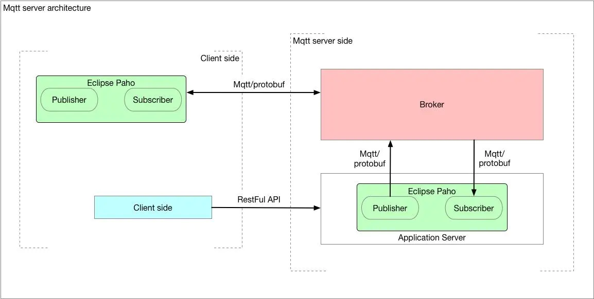

# MQTT Server 搭建

本应用采取Mosquitto作为MQTT 服务器进行使用

开发和运行环境均为macOS

## Architecture



### Server Side

- Broker：(核心)消息管理，类似 pub-sub 队列，本应用中即Mosquitto

- Application Server：用于处理RESTful的请求，转发为MQTT消息，本应用中集成到springboot中

- Publisher 本质是MQTT client，用于发布server端消息到broker，本应用中不涉及

- Subscriber 本质是Mqtt client，用于从broker订阅client端消息，本应用中集成到springboot中

### Client side

- Publisher：用于发布client端消息到broker，本应用中用client进行模拟

- Subscriber：用于从broker订阅server端的消息，本应用中不涉及

- Client：用于发送RESTful请求给Application Server触发消息pub/sub，本应用中即网页用户的使用

## Install Mosquitto

示例为MacOS环境下，需要提前安装HomeBrew

### 安装

``` bash
brew install mosquitto
```

### 启动和停止

``` bash
brew services start mosquitto
brew services stop mosquitto
```

### 配置用户

在`/usr/local/etc/mosquitto/mosquitto.conf`这个路径下进行多个文件的配置，添加用户名和密码，并指定要监听（给予权限）的Topic，然后重启服务。

## Test

使用client文件夹下的例子，根据README.md的指引进行操作，然后将MQTTConfig中的用户名和密码更改为你自己的用户名和密码，最后运行iotclient项目。

如果观察到信息的输出，说明安装和配置成功。


